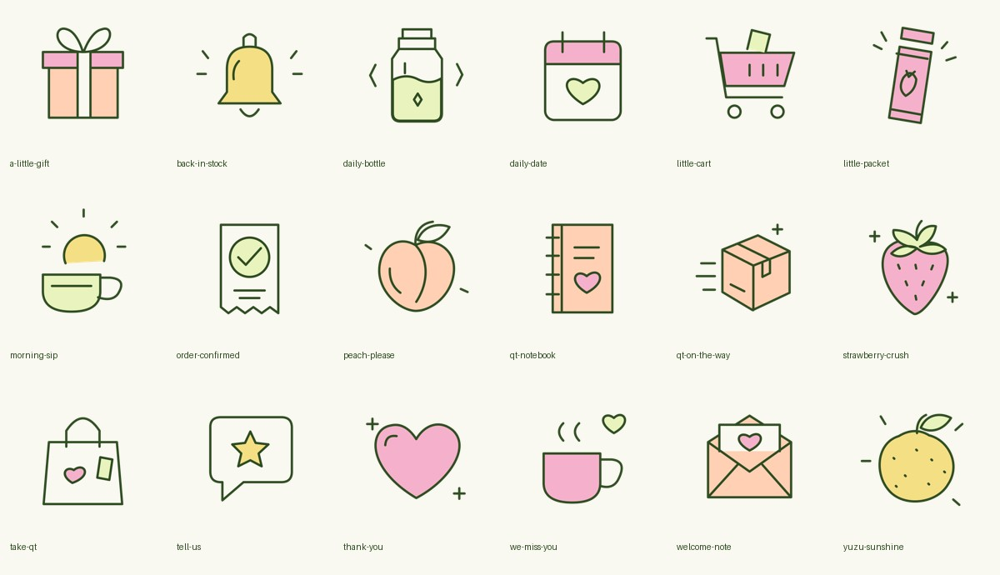

# QT Matcha — email design & asset kit

A shared starting point for QT Matcha marketing and service emails. **Use the approved “02 / Soft Waves” direction:** everyday cream, bright QT accents, bold brand typography, small illustrated moments, and gentle wave transitions.

## Start here

1. Read [the design specifications](docs/DESIGN-SYSTEM.md).
2. Choose an email recipe from [the email roadmap](docs/EMAIL-RECIPES.md).
3. Browse [the illustrated design references](docs/DESIGN-REFERENCES.md) and [the approved lifestyle collection](docs/ASSETS.md).
4. Follow [the Klaviyo / Shopify build guide](docs/IMPLEMENTATION.md).
5. Complete [the review checklist](docs/REVIEW.md) before sending.

**Visual gallery:** download this repository, open `index.html`, and browse the artwork, photos, and designs. To preview through a local web server, run `python3 -m http.server 4183` here and visit `http://localhost:4183`.

## What is included

| Folder | Contents |
|---|---|
| `assets/illustrations/svg/` | 21 editable vector illustrations (18 occasion doodles + 3 packet instruction drawings), exported from our Figma artwork |
| `assets/illustrations/png/` | Matching transparent PNGs, exported at 480 px for email use |
| `assets/lifestyle/webp/` | All 17 approved original website lifestyle images |
| `assets/lifestyle/email-jpg/` | Matching email-friendly JPEG exports, up to 1200 px wide |
| `assets/dividers/` | Three 1200 × 96 PNG wave transitions; display at 600 × 48 |
| `assets/product/` | Three single packets and three matching fruit still lifes |
| `assets/brand/` | QT wordmark and three-packet product image |
| `designs/` | Seven email concepts, each in desktop/mobile PNG references, plus contact sheets |
| `templates/` | Current Welcome 1 HTML, Klaviyo DND definition, and local preview |
| `docs/` | Design rules, email recipes, asset catalog, implementation and review guidance |
| `design-tokens.json` | Machine-readable palette and typography/spacing guidance |

## What is implemented vs. still a concept

**Welcome 1 / Soft Waves is implemented in Klaviyo and remains a draft.** It uses Bricolage Grotesque ExtraBold headings, Figtree body/buttons, a welcome-note illustration, the existing `QTCLUB15` offer, product imagery, and wave dividers. Fonts are registered in the QT Klaviyo account. Nothing in this repository sends emails or activates flows.

The other designs are visual concepts to build from—not configured automations or finished Shopify notification templates. The latest suggested spacing/offer refinements are listed in [the review checklist](docs/REVIEW.md); they have not all been applied to Welcome 1.

## Source of truth

- [Figma Emails page](https://www.figma.com/design/giGs9v9H4t9P1YwRADXeHI?node-id=589-2): editable designs and original artwork; Figma access is managed separately.
- [Welcome 1 in Klaviyo](https://www.klaviyo.com/email-template-editor/WM7sxq): current draft, account access required.
- [Reusable Soft Waves template](https://www.klaviyo.com/email-template-editor/XTrhe2): starting point for future emails, account access required.
- [QT website](https://qtmatcha.com): current customer-facing product details.
- [Website source repository](https://github.com/dollaz-ai/qt-matcha-site): the earlier approved website asset selection. The live Shopify site may contain later team edits.

Snapshot: September 25, 2026. Exported design concepts may contain placeholder copy. Confirm stock, offers, product facts and policy details before use. No variety-pack visual direction is approved for these emails.

## Sharing and usage

This repository is public so the QT team can share it easily. Public availability does **not** grant a stock-art or open-source license to QT branding, photography, illustrations, or designs. See [usage notes](USAGE.md). No customer lists, API credentials, orders, or subscriber data are included.
