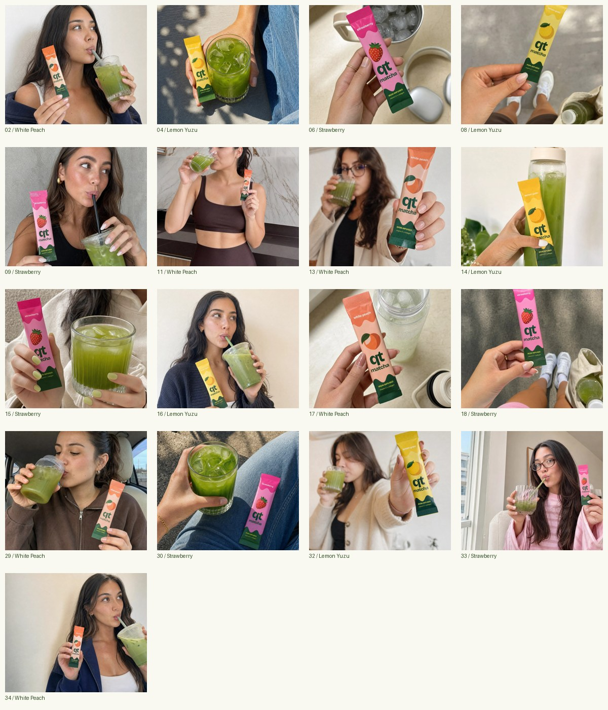

# Asset catalog

## Illustrations

Edit SVG masters; use transparent PNGs in emails. Occasion doodles use a 160 × 160 coordinate space; the three original packet instruction icons use 28 × 28 and a relatively heavier line. Scale instruction icons to around 28–40 px in step rows.

| Asset | Use | SVG | PNG |
|---|---|---|---|
| a-little-gift | Gift / genuine offer | [SVG](../assets/illustrations/svg/a-little-gift.svg) | [PNG](../assets/illustrations/png/a-little-gift.png) |
| back-in-stock | Availability / launch | [SVG](../assets/illustrations/svg/back-in-stock.svg) | [PNG](../assets/illustrations/png/back-in-stock.png) |
| daily-bottle | Mixing / hydration ritual | [SVG](../assets/illustrations/svg/daily-bottle.svg) | [PNG](../assets/illustrations/png/daily-bottle.png) |
| daily-date | Routine / reminder | [SVG](../assets/illustrations/svg/daily-date.svg) | [PNG](../assets/illustrations/png/daily-date.png) |
| instruction-pour | Step 2: pour | [SVG](../assets/illustrations/svg/instruction-pour.svg) | [PNG](../assets/illustrations/png/instruction-pour.png) |
| instruction-shake | Step 3: shake or stir | [SVG](../assets/illustrations/svg/instruction-shake.svg) | [PNG](../assets/illustrations/png/instruction-shake.png) |
| instruction-tear | Step 1: tear | [SVG](../assets/illustrations/svg/instruction-tear.svg) | [PNG](../assets/illustrations/png/instruction-tear.png) |
| little-cart | Abandoned checkout | [SVG](../assets/illustrations/svg/little-cart.svg) | [PNG](../assets/illustrations/png/little-cart.png) |
| little-packet | Product introduction | [SVG](../assets/illustrations/svg/little-packet.svg) | [PNG](../assets/illustrations/png/little-packet.png) |
| morning-sip | Ritual / morning newsletter | [SVG](../assets/illustrations/svg/morning-sip.svg) | [PNG](../assets/illustrations/png/morning-sip.png) |
| order-confirmed | Order confirmation | [SVG](../assets/illustrations/svg/order-confirmed.svg) | [PNG](../assets/illustrations/png/order-confirmed.png) |
| peach-please | White Peach spotlight | [SVG](../assets/illustrations/svg/peach-please.svg) | [PNG](../assets/illustrations/png/peach-please.png) |
| qt-notebook | Founder / editorial | [SVG](../assets/illustrations/svg/qt-notebook.svg) | [PNG](../assets/illustrations/png/qt-notebook.png) |
| qt-on-the-way | Shipping | [SVG](../assets/illustrations/svg/qt-on-the-way.svg) | [PNG](../assets/illustrations/png/qt-on-the-way.png) |
| strawberry-crush | Strawberry spotlight | [SVG](../assets/illustrations/svg/strawberry-crush.svg) | [PNG](../assets/illustrations/png/strawberry-crush.png) |
| take-qt | Travel / everyday routine | [SVG](../assets/illustrations/svg/take-qt.svg) | [PNG](../assets/illustrations/png/take-qt.png) |
| tell-us | Review / feedback | [SVG](../assets/illustrations/svg/tell-us.svg) | [PNG](../assets/illustrations/png/tell-us.png) |
| thank-you | Community / appreciation | [SVG](../assets/illustrations/svg/thank-you.svg) | [PNG](../assets/illustrations/png/thank-you.png) |
| we-miss-you | Win-back | [SVG](../assets/illustrations/svg/we-miss-you.svg) | [PNG](../assets/illustrations/png/we-miss-you.png) |
| welcome-note | Welcome / signup | [SVG](../assets/illustrations/svg/welcome-note.svg) | [PNG](../assets/illustrations/png/welcome-note.png) |
| yuzu-sunshine | Lemon Yuzu spotlight | [SVG](../assets/illustrations/svg/yuzu-sunshine.svg) | [PNG](../assets/illustrations/png/yuzu-sunshine.png) |

## Approved lifestyle images

All 17 were selected with green Finder tags for the website. Original WebP files are preserved; JPEG versions are prepared for email. Use the descriptions below as starting-point alt text, then adapt to the actual crop. Crop to roughly 4:3 or 3:2 when useful, keep the packet and relevant fruit visible, and never stretch the photo.

| Photo | Flavor | Description | Email JPEG | Original |
|---|---|---|---|---|
| 02 | White Peach | White Peach QT with an iced matcha at home | [JPG](../assets/lifestyle/email-jpg/qt-lifestyle-02.jpg) | [WebP](../assets/lifestyle/webp/qt-lifestyle-02.webp) |
| 04 | Lemon Yuzu | Lemon Yuzu QT and iced matcha in the sunshine | [JPG](../assets/lifestyle/email-jpg/qt-lifestyle-04.jpg) | [WebP](../assets/lifestyle/webp/qt-lifestyle-04.webp) |
| 06 | Strawberry | Strawberry QT beside an open ice-filled bottle | [JPG](../assets/lifestyle/email-jpg/qt-lifestyle-06.jpg) | [WebP](../assets/lifestyle/webp/qt-lifestyle-06.webp) |
| 08 | Lemon Yuzu | Lemon Yuzu QT tucked into an everyday routine | [JPG](../assets/lifestyle/email-jpg/qt-lifestyle-08.jpg) | [WebP](../assets/lifestyle/webp/qt-lifestyle-08.webp) |
| 09 | Strawberry | Strawberry QT and an iced matcha moment | [JPG](../assets/lifestyle/email-jpg/qt-lifestyle-09.jpg) | [WebP](../assets/lifestyle/webp/qt-lifestyle-09.webp) |
| 11 | White Peach | White Peach QT after a workout | [JPG](../assets/lifestyle/email-jpg/qt-lifestyle-11.jpg) | [WebP](../assets/lifestyle/webp/qt-lifestyle-11.webp) |
| 13 | White Peach | White Peach QT packet held beside a refreshing drink | [JPG](../assets/lifestyle/email-jpg/qt-lifestyle-13.jpg) | [WebP](../assets/lifestyle/webp/qt-lifestyle-13.webp) |
| 14 | Lemon Yuzu | Lemon Yuzu QT with a green matcha water bottle | [JPG](../assets/lifestyle/email-jpg/qt-lifestyle-14.jpg) | [WebP](../assets/lifestyle/webp/qt-lifestyle-14.webp) |
| 15 | Strawberry | Strawberry QT and iced matcha during a cozy pause | [JPG](../assets/lifestyle/email-jpg/qt-lifestyle-15.jpg) | [WebP](../assets/lifestyle/webp/qt-lifestyle-15.webp) |
| 16 | Lemon Yuzu | Lemon Yuzu QT and a daily matcha break | [JPG](../assets/lifestyle/email-jpg/qt-lifestyle-16.jpg) | [WebP](../assets/lifestyle/webp/qt-lifestyle-16.webp) |
| 17 | White Peach | White Peach QT beside a bottle ready to mix | [JPG](../assets/lifestyle/email-jpg/qt-lifestyle-17.jpg) | [WebP](../assets/lifestyle/webp/qt-lifestyle-17.webp) |
| 18 | Strawberry | Strawberry QT on the go | [JPG](../assets/lifestyle/email-jpg/qt-lifestyle-18.jpg) | [WebP](../assets/lifestyle/webp/qt-lifestyle-18.webp) |
| 29 | White Peach | White Peach QT and iced matcha on the road | [JPG](../assets/lifestyle/email-jpg/qt-lifestyle-29.jpg) | [WebP](../assets/lifestyle/webp/qt-lifestyle-29.webp) |
| 30 | Strawberry | Iced matcha and a Strawberry QT packet in the sunshine | [JPG](../assets/lifestyle/email-jpg/qt-lifestyle-30.jpg) | [WebP](../assets/lifestyle/webp/qt-lifestyle-30.webp) |
| 32 | Lemon Yuzu | Lemon Yuzu QT and an iced drink at home | [JPG](../assets/lifestyle/email-jpg/qt-lifestyle-32.jpg) | [WebP](../assets/lifestyle/webp/qt-lifestyle-32.webp) |
| 33 | Strawberry | Strawberry QT during a sunny afternoon break | [JPG](../assets/lifestyle/email-jpg/qt-lifestyle-33.jpg) | [WebP](../assets/lifestyle/webp/qt-lifestyle-33.webp) |
| 34 | White Peach | White Peach QT and a refreshing little pause | [JPG](../assets/lifestyle/email-jpg/qt-lifestyle-34.jpg) | [WebP](../assets/lifestyle/webp/qt-lifestyle-34.webp) |

Website anchor placements: 30 hero, 14 “A little more inside,” 15 “Meet your new daily plus-one.” Current live Shopify placements may differ. Keep the original full image as the source for future crops.

## Product and fruit still lifes

Six PNG exports in `assets/product/` preserve the three single-flavor packets and their website fruit still lifes. Three-packet imagery is in `assets/brand/three-packets.png`; this is a flavor lineup, not an approved variety-box design.
